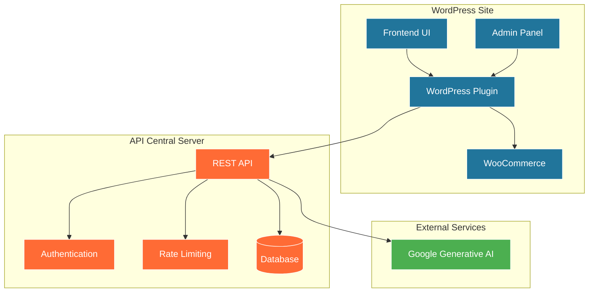

# Documento de Diseño - Plugin Mirrorly para WordPress

## Visión General

Mirrorly es un plugin de WordPress/WooCommerce que integra inteligencia artificial para permitir a los usuarios visualizarse usando productos. El sistema consta de tres componentes principales:

1. **Plugin WordPress** (FREE/PRO) - Interfaz de usuario y administración
2. **API REST Centralizada** (Node.js/TypeScript) - Gestión de licencias, límites y proxy a Google Generative AI
3. **Google Generative AI** - Generación de imágenes con IA

## Arquitectura del Sistema



## Componentes y Interfaces

### 1. Plugin WordPress

#### 1.1 Estructura de Archivos
```
mirrorly/
├── mirrorly.php                 # Plugin principal
├── includes/
│   ├── class-mirrorly.php       # Clase principal
│   ├── class-admin.php          # Panel de administración
│   ├── class-frontend.php       # Funcionalidad frontend
│   ├── class-api-client.php     # Cliente para API central
│   ├── class-license.php        # Gestión de licencias
│   └── class-product-meta.php   # Metabox de productos
├── assets/
│   ├── css/
│   ├── js/
│   └── images/
├── templates/
│   ├── frontend-widget.php      # Widget del producto
│   └── admin-settings.php       # Página de configuración
└── languages/
```

#### 1.2 Hooks y Filtros Principales
```php
// Hooks de activación/desactivación
register_activation_hook(__FILE__, 'mirrorly_activate');
register_deactivation_hook(__FILE__, 'mirrorly_deactivate');

// Hooks de WooCommerce
add_action('woocommerce_single_product_summary', 'mirrorly_display_widget', 25);
add_action('woocommerce_product_options_general_product_data', 'mirrorly_product_fields');
add_action('woocommerce_process_product_meta', 'mirrorly_save_product_fields');

// Hooks de admin
add_action('admin_menu', 'mirrorly_admin_menu');
add_action('admin_enqueue_scripts', 'mirrorly_admin_scripts');

// AJAX endpoints
add_action('wp_ajax_mirrorly_generate', 'mirrorly_handle_generation');
add_action('wp_ajax_nopriv_mirrorly_generate', 'mirrorly_handle_generation');
```

#### 1.3 Clases Principales

**Clase Mirrorly (Principal)**
```php
class Mirrorly {
    private $version = '1.0.0';
    private $api_client;
    private $license;

    public function __construct() {
        $this->load_dependencies();
        $this->define_admin_hooks();
        $this->define_public_hooks();
    }

    public function run() {
        // Inicializar plugin
    }
}
```

**Clase API Client**
```php
class Mirrorly_API_Client {
    private $api_url = 'https://api.mirrorly.com/v1/';
    private $api_key;

    public function generate_image($user_image, $product_image, $product_id) {
        // Llamada a API central
    }

    public function validate_license($license_key, $domain) {
        // Validación de licencia
    }

    public function check_limits() {
        // Verificar límites de uso
    }
}
```

### 2. API REST Centralizada

#### 2.1 Arquitectura de la API (Node.js/TypeScript)

**Estructura de Directorios**
```
mirrorly-api/
├── src/
│   ├── controllers/
│   │   ├── AuthController.ts
│   │   ├── GenerationController.ts
│   │   └── LicenseController.ts
│   ├── models/
│   │   ├── User.ts
│   │   ├── License.ts
│   │   └── Usage.ts
│   ├── services/
│   │   ├── GoogleAIService.ts
│   │   ├── RateLimitService.ts
│   │   └── ImageProcessor.ts
│   ├── middleware/
│   │   ├── AuthMiddleware.ts
│   │   └── RateLimitMiddleware.ts
│   ├── routes/
│   │   ├── auth.ts
│   │   ├── generation.ts
│   │   └── limits.ts
│   ├── config/
│   │   ├── database.ts
│   │   └── app.ts
│   └── app.ts                  # Aplicación principal
├── dist/                       # Código compilado
├── tests/
├── package.json
├── tsconfig.json
└── .env.example
```

#### 2.2 Endpoints de la API

**Autenticación y Registro**
```
POST /auth/register-free
POST /auth/register-pro
POST /auth/validate-license
GET  /auth/status
```

**Generación de Imágenes**
```
POST /generate/image
GET  /generate/status/{id}
GET  /generate/result/{id}
```

**Gestión de Límites**
```
GET  /limits/current
GET  /limits/usage
POST /limits/reset (admin only)
```

#### 2.3 Configuración del Proyecto Node.js

**package.json**
```json
{
  "name": "mirrorly-api",
  "version": "1.0.0",
  "description": "API REST para plugin Mirrorly WordPress",
  "main": "dist/app.js",
  "scripts": {
    "build": "tsc",
    "start": "node dist/app.js",
    "dev": "ts-node-dev --respawn --transpile-only src/app.ts",
    "test": "jest",
    "lint": "eslint src/**/*.ts"
  },
  "dependencies": {
    "@google/generative-ai": "^0.2.1",
    "express": "^4.18.2",
    "cors": "^2.8.5",
    "helmet": "^7.1.0",
    "express-rate-limit": "^7.1.5",
    "multer": "^1.4.5-lts.1",
    "sharp": "^0.32.6",
    "mysql2": "^3.6.5",
    "sequelize": "^6.35.2",
    "jsonwebtoken": "^9.0.2",
    "bcryptjs": "^2.4.3",
    "dotenv": "^16.3.1",
    "joi": "^17.11.0",
    "winston": "^3.11.0"
  },
  "devDependencies": {
    "@types/node": "^20.10.4",
    "@types/express": "^4.17.21",
    "@types/cors": "^2.8.17",
    "@types/multer": "^1.4.11",
    "@types/jsonwebtoken": "^9.0.5",
    "@types/bcryptjs": "^2.4.6",
    "typescript": "^5.3.3",
    "ts-node-dev": "^2.0.0",
    "jest": "^29.7.0",
    "@types/jest": "^29.5.8",
    "eslint": "^8.55.0",
    "@typescript-eslint/eslint-plugin": "^6.13.1"
  }
}
```

**tsconfig.json**
```json
{
  "compilerOptions": {
    "target": "ES2020",
    "module": "commonjs",
    "lib": ["ES2020"],
    "outDir": "./dist",
    "rootDir": "./src",
    "strict": true,
    "esModuleInterop": true,
    "skipLibCheck": true,
    "forceConsistentCasingInFileNames": true,
    "resolveJsonModule": true,
    "declaration": true,
    "declarationMap": true,
    "sourceMap": true
  },
  "include": ["src/**/*"],
  "exclude": ["node_modules", "dist", "tests"]
}
```

### 3. Integración con Google Generative AI

#### 3.1 Servicio de Google AI
```typescript
import { GoogleGenerativeAI } from '@google/generative-ai';

export class GoogleAIService {
    private genAI: GoogleGenerativeAI;
    private textModel: any;
    private visionModel: any;

    constructor(apiKey: string) {
        this.genAI = new GoogleGenerativeAI(apiKey);
        this.textModel = this.genAI.getGenerativeModel({ model: 'gemini-pro' });
        this.visionModel = this.genAI.getGenerativeModel({ model: 'gemini-pro-vision' });
    }

    async generateImage(userImage: Buffer, productImage: Buffer, options: GenerationOptions = {}): Promise<GenerationResult> {
        try {
            // PASO 1: Generar prompt optimizado analizando las imágenes
            const optimizedPrompt = await this.generateOptimizedPrompt(userImage, productImage, options);

            // PASO 2: Generar imagen usando el prompt optimizado
            const finalImage = await this.generateFinalImage(userImage, productImage, optimizedPrompt);

            return finalImage;

        } catch (error) {
            throw new Error(`Google AI generation failed: ${error.message}`);
        }
    }

    private async generateOptimizedPrompt(userImage: Buffer, productImage: Buffer, options: GenerationOptions): Promise<string> {
        const analysisPrompt = `
        Analiza estas dos imágenes:
        1. Primera imagen: Una persona
        2. Segunda imagen: Un producto de e-commerce

        Basándote en el análisis de ambas imágenes, genera un prompt detallado y específico para crear una imagen compuesta que:
        - Muestre a la persona usando/portando el producto de manera natural y atractiva
        - Sea perfecta para aumentar las ventas en e-commerce
        - Tenga iluminación profesional y composición atractiva
        - Mantenga la identidad de la persona y las características del producto
        - Sea realista y creíble para el consumidor

        Tipo de producto detectado: ${options.productType || 'automático'}
        Estilo deseado: ${options.style || 'profesional'}

        Devuelve SOLO el prompt optimizado, sin explicaciones adicionales.
        `;

        const imageParts = [
            {
                inlineData: {
                    data: userImage.toString('base64'),
                    mimeType: 'image/jpeg'
                }
            },
            {
                inlineData: {
                    data: productImage.toString('base64'),
                    mimeType: 'image/jpeg'
                }
            }
        ];

        const result = await this.visionModel.generateContent([analysisPrompt, ...imageParts]);
        const response = await result.response;
        return response.text().trim();
    }

    private async generateFinalImage(userImage: Buffer, productImage: Buffer, optimizedPrompt: string): Promise<GenerationResult> {
        const imageParts = [
            {
                inlineData: {
                    data: userImage.toString('base64'),
                    mimeType: 'image/jpeg'
                }
            },
            {
                inlineData: {
                    data: productImage.toString('base64'),
                    mimeType: 'image/jpeg'
                }
            }
        ];

        const finalPrompt = `${optimizedPrompt}

        INSTRUCCIONES TÉCNICAS:
        - Mantén la calidad profesional de e-commerce
        - Asegúrate de que la composición sea atractiva para ventas
        - La imagen debe verse natural y creíble
        - Mantén la resolución alta para uso web
        `;

        const result = await this.visionModel.generateContent([finalPrompt, ...imageParts]);
        return this.processResult(result, optimizedPrompt);
    }

    private processResult(result: any, usedPrompt: string): GenerationResult {
        // Procesar respuesta de Google AI
        // Extraer imagen generada
        // Optimizar para web
        return {
            success: true,
            imageUrl: result.imageUrl,
            processingTime: result.processingTime,
            usedPrompt: usedPrompt, // Para debugging y mejoras
            metadata: {
                model: 'gemini-pro-vision',
                twoStepProcess: true
            }
        };
    }
}

interface GenerationOptions {
    style?: 'realistic' | 'artistic' | 'professional';
    quality?: 'standard' | 'high' | 'premium';
    productType?: 'clothing' | 'jewelry' | 'accessories' | 'shoes' | 'bags' | 'automático';
}

interface GenerationResult {
    success: boolean;
    imageUrl?: string;
    error?: string;
    processingTime?: number;
    usedPrompt?: string;
    metadata?: {
        model: string;
        twoStepProcess: boolean;
        promptGenerationTime?: number;
        imageGenerationTime?: number;
    };
}
```

#### 3.2 Controlador de Generación
```typescript
import { Request, Response } from 'express';
import { GoogleAIService } from '../services/GoogleAIService';
import { RateLimitService } from '../services/RateLimitService';
import { ImageProcessor } from '../services/ImageProcessor';

export class GenerationController {
    private googleAI: GoogleAIService;
    private rateLimitService: RateLimitService;
    private imageProcessor: ImageProcessor;

    constructor() {
        this.googleAI = new GoogleAIService(process.env.GOOGLE_AI_API_KEY!);
        this.rateLimitService = new RateLimitService();
        this.imageProcessor = new ImageProcessor();
    }

    async generateImage(req: Request, res: Response): Promise<void> {
        try {
            const { licenseId } = req.body;
            const userImage = req.files?.userImage as Express.Multer.File;
            const productImage = req.files?.productImage as Express.Multer.File;

            // Verificar límites
            const canGenerate = await this.rateLimitService.checkLimits(licenseId);
            if (!canGenerate) {
                res.status(429).json({ error: 'Rate limit exceeded' });
                return;
            }

            // Procesar imágenes
            const processedUserImage = await this.imageProcessor.optimize(userImage.buffer);
            const processedProductImage = await this.imageProcessor.optimize(productImage.buffer);

            // Generar imagen con flujo de dos pasos
            const result = await this.googleAI.generateImage(
                processedUserImage,
                processedProductImage,
                {
                    ...req.body.options,
                    productType: req.body.productType || 'automático'
                }
            );

            // Actualizar contadores
            await this.rateLimitService.incrementUsage(licenseId);

            res.json(result);

        } catch (error) {
            res.status(500).json({ error: error.message });
        }
    }
}
```

#### 2.4 Modelos de Datos

**Tabla: licenses**
```sql
CREATE TABLE licenses (
    id INT PRIMARY KEY AUTO_INCREMENT,
    license_key VARCHAR(255) UNIQUE,
    domain VARCHAR(255),
    type ENUM('free', 'pro_basic', 'pro_premium'),
    status ENUM('active', 'expired', 'suspended'),
    created_at TIMESTAMP,
    expires_at TIMESTAMP,
    monthly_limit INT,
    current_usage INT,
    last_reset DATE
);
```

**Tabla: generations**
```sql
CREATE TABLE generations (
    id INT PRIMARY KEY AUTO_INCREMENT,
    license_id INT,
    product_id VARCHAR(100),
    user_image_hash VARCHAR(64),
    product_image_hash VARCHAR(64),
    result_image_url VARCHAR(500),
    status ENUM('pending', 'processing', 'completed', 'failed'),
    created_at TIMESTAMP,
    completed_at TIMESTAMP,
    nanobanana_request_id VARCHAR(100),
    FOREIGN KEY (license_id) REFERENCES licenses(id)
);
```

**Tabla: rate_limits**
```sql
CREATE TABLE rate_limits (
    id INT PRIMARY KEY AUTO_INCREMENT,
    license_id INT,
    last_request TIMESTAMP,
    request_count INT,
    window_start TIMESTAMP,
    FOREIGN KEY (license_id) REFERENCES licenses(id)
);
```

### 3. Integración con Nanobanana

#### 3.1 Servicio de Nanobanana
```php
class NanobananaService {
    private $api_key;
    private $base_url = 'https://api.nanobanana.com/v1/';

    public function generateImage($userImage, $productImage, $options = []) {
        $payload = [
            'user_image' => base64_encode($userImage),
            'product_image' => base64_encode($productImage),
            'style' => $options['style'] ?? 'realistic',
            'quality' => $options['quality'] ?? 'high'
        ];

        return $this->makeRequest('generate', $payload);
    }

    private function makeRequest($endpoint, $data) {
        // Implementación de la llamada HTTP
        // Manejo de timeouts y reintentos
        // Procesamiento de respuestas y errores
    }
}
```

## Modelos de Datos

### Plugin WordPress

**Opciones del Plugin**
```php
$mirrorly_options = [
    'api_key' => '',
    'license_key' => '',
    'license_type' => 'free',
    'custom_message' => 'Ver cómo te queda este producto',
    'widget_colors' => [
        'primary' => '#007cba',
        'secondary' => '#ffffff',
        'text' => '#333333'
    ],
    'enabled_products' => [], // Solo PRO
    'max_products' => 3, // FREE limit
];
```

**Meta de Productos**
```php
$product_meta = [
    '_mirrorly_enabled' => 'yes|no',
    '_mirrorly_image_id' => 123, // ID de imagen de galería
    '_mirrorly_custom_message' => 'Mensaje personalizado',
];
```

### API Central

**Configuración de Límites por Tipo**
```php
$limits_config = [
    'free' => [
        'monthly_generations' => 10,
        'rate_limit_seconds' => 60,
        'max_products' => 3,
        'image_max_size' => 2048, // KB
    ],
    'pro_basic' => [
        'monthly_generations' => 100,
        'rate_limit_seconds' => 30,
        'max_products' => -1, // unlimited
        'image_max_size' => 5120, // KB
    ],
    'pro_premium' => [
        'monthly_generations' => 500,
        'rate_limit_seconds' => 15,
        'max_products' => -1, // unlimited
        'image_max_size' => 10240, // KB
    ]
];
```

## Manejo de Errores

### Códigos de Error Estándar

```php
const ERROR_CODES = [
    // Autenticación
    'AUTH_001' => 'API key inválida',
    'AUTH_002' => 'Licencia expirada',
    'AUTH_003' => 'Dominio no autorizado',

    // Límites
    'LIMIT_001' => 'Límite mensual excedido',
    'LIMIT_002' => 'Rate limit excedido',
    'LIMIT_003' => 'Máximo de productos alcanzado',

    // Imágenes
    'IMG_001' => 'Formato de imagen no válido',
    'IMG_002' => 'Imagen demasiado grande',
    'IMG_003' => 'Error al procesar imagen',

    // Google AI
    'GAI_001' => 'Error en servicio de Google AI',
    'GAI_002' => 'Timeout en generación',
    'GAI_003' => 'Cuota de API excedida en Google AI',
];
```

### Estrategia de Manejo de Errores

1. **Errores de Usuario**: Mostrar mensajes amigables en frontend
2. **Errores de Sistema**: Logging detallado para debugging
3. **Errores de API**: Códigos HTTP estándar + mensajes JSON
4. **Fallbacks**: Degradación elegante cuando sea posible

## Estrategia de Testing

### Testing del Plugin WordPress

1. **Unit Tests**: PHPUnit para clases individuales
2. **Integration Tests**: Pruebas con WooCommerce
3. **E2E Tests**: Selenium para flujos completos
4. **Performance Tests**: Carga y stress testing

### Testing de la API

1. **API Tests**: Postman/Newman para endpoints
2. **Load Tests**: Apache Bench para rendimiento
3. **Security Tests**: Penetration testing básico
4. **Database Tests**: Integridad y performance de queries

### Casos de Prueba Críticos

1. **Límites de Uso**: Verificar que se respeten todos los límites
2. **Rate Limiting**: Probar bloqueos por exceso de requests
3. **Failover**: Comportamiento cuando Google AI falla
4. **Seguridad**: Validación de imágenes y prevención de ataques
5. **Licencias**: Validación y expiración correcta

## Consideraciones de Seguridad

### Plugin WordPress

1. **Sanitización**: Todas las entradas de usuario
2. **Nonces**: Para formularios y AJAX
3. **Capabilities**: Verificar permisos de usuario
4. **File Upload**: Validación estricta de imágenes

### API Central

1. **Rate Limiting**: Prevenir ataques DDoS
2. **Input Validation**: Validar todos los parámetros
3. **SQL Injection**: Usar prepared statements
4. **CORS**: Configurar correctamente para dominios autorizados
5. **HTTPS**: Forzar conexiones seguras

### Datos Sensibles

1. **API Keys**: Encriptación en base de datos
2. **Imágenes**: Eliminación automática después de procesamiento
3. **Logs**: No registrar información personal
4. **Backups**: Encriptación de respaldos de BD

## Consideraciones de Performance

### Optimizaciones del Plugin

1. **Lazy Loading**: Cargar widget solo cuando sea necesario
2. **Caching**: Cache de respuestas de API por tiempo limitado
3. **Image Optimization**: Redimensionar antes de enviar
4. **Minification**: CSS/JS minificados en producción

### Optimizaciones de la API

1. **Database Indexing**: Índices en campos de búsqueda frecuente
2. **Connection Pooling**: Reutilizar conexiones de BD
3. **Response Caching**: Cache de respuestas comunes
4. **CDN**: Para servir imágenes generadas

### Escalabilidad

1. **Horizontal Scaling**: API stateless para múltiples instancias
2. **Queue System**: Cola para procesamiento asíncrono
3. **Load Balancing**: Distribución de carga entre servidores
4. **Monitoring**: Métricas de performance y alertas