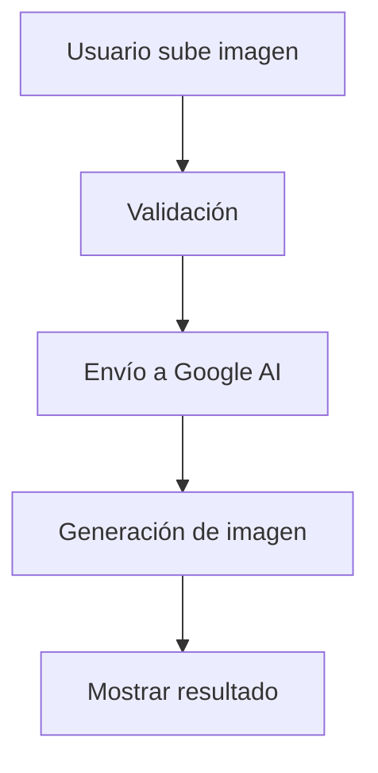

# Documentación de Mirrorly

Este repositorio contiene la documentación oficial del plugin **Mirrorly** para WordPress/WooCommerce, un plugin innovador que permite a los usuarios visualizarse usando productos mediante inteligencia artificial.

## 🚀 Acerca de Mirrorly

Mirrorly es un plugin que integra inteligencia artificial para generar imágenes realistas donde los clientes aparecen "usando" o "portando" los productos de tu tienda WooCommerce. Utiliza Google Generative AI para crear experiencias de compra inmersivas que aumentan las conversiones y reducen las devoluciones.

### Características Principales

- **Visualización con IA**: Los clientes pueden subir su foto y ver cómo se verían con tus productos
- **Integración WooCommerce**: Funciona perfectamente con cualquier tema de WooCommerce
- **Versiones FREE y PRO**: Opciones flexibles para diferentes necesidades
- **Shortcode Flexible**: Inserta el widget en cualquier lugar con `[mirrorly]`
- **API Centralizada**: Sistema robusto de licencias y control de uso

## 📖 Documentación Disponible

Esta documentación está organizada en las siguientes secciones:

### 📚 Páginas de Documentación

- **[Guía de Usuario](user-guide.md)** - Introducción completa a Mirrorly y productos compatibles
- **[Configuración de Google AI](google-ai-setup.md)** - Cómo configurar Google AI Studio para usar con Mirrorly
- **[Guía del Shortcode](shortcode-guide.md)** - Documentación completa del shortcode `[mirrorly]`

### 🔧 Archivos de Configuración

- **[Gemfile](Gemfile)** - Dependencias de Jekyll para el sitio de documentación
- **[_config.yml](_config.yml)** - Configuración del sitio Jekyll con tema just-the-docs

## 🌐 Sitio Web de Documentación

La documentación está publicada en GitHub Pages y utiliza el tema [Just the Docs] para una navegación clara y búsqueda integrada.

**URL del sitio**: [Visitar documentación en línea](https://tu-usuario.github.io/mirrorly/)

## 🛠️ Desarrollo Local

Para trabajar con la documentación localmente:

### Prerrequisitos

- Ruby 2.5.0 o superior
- Bundler
- Jekyll

### Instalación

```bash
# Clonar el repositorio
git clone https://github.com/MrViSiOn/mirrorly-docs.git
cd mirrorly/docs

# Instalar dependencias
bundle install

# Servir localmente
bundle exec jekyll serve --port 4000
```

La documentación estará disponible en `http://localhost:4000`

## 📝 Contribuir a la Documentación

### Estructura de Archivos

```
docs/
├── _config.yml              # Configuración de Jekyll
├── index.md                 # Página principal
├── user-guide.md           # Guía de usuario
├── google-ai-setup.md      # Configuración de Google AI
├── shortcode-guide.md      # Documentación del shortcode
├── Gemfile                 # Dependencias de Jekyll
└── _sass/                  # Estilos personalizados
```

### Agregar Nueva Página

1. Crea un archivo `.md` en el directorio `docs/`
2. Agrega el front matter apropiado:

```yaml
---
title: Título de la Página
layout: default
nav_order: 5
description: "Descripción de la página"
---
```

3. Escribe el contenido en Markdown
4. Haz commit y push de los cambios

### Publicación Automática

Los cambios en el directorio `docs/` se publican automáticamente en GitHub Pages usando GitHub Actions. Ver [SUBTREE_PUBLISHING.md](SUBTREE_PUBLISHING.md) para más detalles sobre el proceso de publicación.

## 🚀 Publicación en GitHub Pages

La documentación se publica automáticamente usando GitHub Actions cuando se realizan cambios en el directorio `docs/`.

### Configuración Inicial

1. Ve a **Settings > Pages** en tu repositorio de GitHub
2. Selecciona **Source**: `GitHub Actions`
3. Los cambios se publicarán automáticamente en cada push

### Proceso de Publicación con Git Subtree

Este proyecto utiliza Git Subtree para mantener la documentación sincronizada:

```bash
# Hacer commit de cambios en docs/
git add docs/
git commit -m "docs: actualizar documentación"

# Publicar con subtree
git subtree push --prefix=docs origin gh-pages
```

Ver [SUBTREE_PUBLISHING.md](SUBTREE_PUBLISHING.md) para instrucciones detalladas.

## 🎨 Personalización del Tema

### Colores y Estilos

Los estilos personalizados se encuentran en `_sass/custom/custom.scss`. Puedes modificar:

- Colores del tema
- Tipografía
- Espaciado
- Componentes personalizados

### Configuración del Sitio

Edita `_config.yml` para personalizar:

```yaml
title: Mirrorly Documentation
description: Plugin de visualización con IA para WooCommerce
url: https://tu-usuario.github.io/mirrorly
```

## 🔍 Funcionalidades del Sitio

### Búsqueda Integrada

El tema just-the-docs incluye búsqueda en tiempo real que indexa todo el contenido automáticamente.

### Navegación Automática

Las páginas se organizan automáticamente según el valor `nav_order` en el front matter.

### Tabla de Contenidos

Cada página puede incluir una tabla de contenidos automática:

```markdown
## Tabla de contenidos
{: .no_toc .text-delta }

1. TOC
{:toc}
```

### Diagramas Mermaid

Soporte integrado para diagramas Mermaid:



## 📋 Checklist de Mantenimiento

- [ ] Actualizar enlaces cuando cambien las URLs
- [ ] Revisar capturas de pantalla periódicamente
- [ ] Mantener ejemplos de código actualizados
- [ ] Verificar que todos los enlaces externos funcionen
- [ ] Actualizar versiones en el Gemfile según sea necesario

## 📞 Soporte y Contacto

Para reportar problemas con la documentación:

1. Abre un [issue en GitHub](https://github.com/MrViSiOn/mirrorly-docs/issues)
2. Usa la etiqueta `documentation`
3. Describe claramente el problema o mejora sugerida

## 📄 Licencia

Esta documentación está licenciada bajo [MIT License]. Eres libre de reutilizar o extender este código; solo incluye la copia original de la licencia.

---

**Mirrorly** - Transformando la experiencia de compra con inteligencia artificial 🚀

[Just the Docs]: https://just-the-docs.github.io/just-the-docs/
[GitHub Pages]: https://docs.github.com/en/pages
[Jekyll]: https://jekyllrb.com
[MIT License]: https://en.wikipedia.org/wiki/MIT_License
